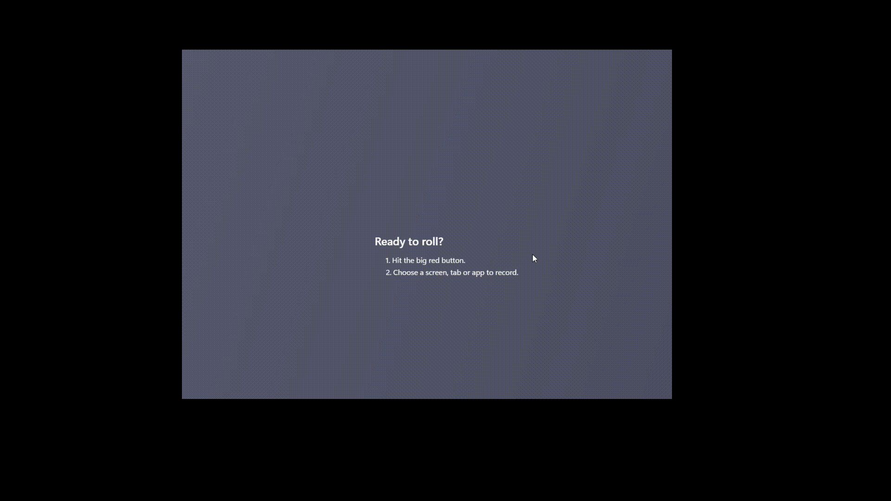

# Snake Game with AI 🎮🐍

Remember the good old days of the Nokia 3310? The legendary Snake game that kept us entertained through countless hours of pixelated joy is back, and it has had an AI upgrade! Now, you can experience the nostalgia while enjoying a touch of modern technology with Python and Pygame.



## The Story Behind the Project

As a child, one of the greatest thrills was seeing how long you could keep that snake going without crashing into the walls or eating your own tail. Those black-and-white pixels were more than just a game; they were a rite of passage into the world of mobile gaming. Fast forward to today, and we live in an age where artificial intelligence and sophisticated programming tools allow us to reimagine those classic days.

This project merges the past with the present: bringing Snake into the era of AI and Python. By combining the simplicity of the original game with a modern twist, the Snake Game with AI aims to provide both a sense of nostalgia and a glimpse into the future of gaming.

## Game Features

- **Classic Yet Modern**: The fundamental gameplay remains unchanged—maneuver your snake to consume food, but with smoother graphics and AI guidance.
- **AI-Powered Movement**: Our AI assists the snake, showcasing how intelligent systems can interact even with simple rules.
- **Score Tracking**: Keep track of your achievements with real-time scoring and high scores.
- **User-Friendly Interface**: Intuitive controls with a vibrant GUI make the game a pleasure to play.
- **Window and Fullscreen Modes**: Enjoy the game in your preferred mode of display.

## How to Dive In

### The Objective

Navigate your snake to devour food appearing across the board. Each snack makes your snake longer and boosts your score. But be cautious—touching the walls or running into your own tail means game over!

### Controls

- Use the **Arrow Keys** to change direction.
- Press **F** to switch between windowed mode and fullscreen.
- After a game over, press **R** to restart.
- Press **Q** to quit the game.

## Getting Started

### Installation Requirements

Before you jump back in time with this classic, ensure your system has:

- **Python 3.x** installed.
- **Pygame** library, which you can install via pip:

  ```bash
  pip install pygame

## Game Features

- **Classic Yet Modern**: The fundamental gameplay remains unchanged—maneuver your snake to consume food, but with smoother graphics and AI guidance.
- **AI-Powered Movement**: Our AI assists the snake, showcasing how intelligent systems can interact even with simple rules.
- **Score Tracking**: Keep track of your achievements with real-time scoring and high scores.
- **User-Friendly Interface**: Intuitive controls with a vibrant GUI make the game a pleasure to play.
- **Window and Fullscreen Modes**: Enjoy the game in your preferred mode of display.

## How to Dive In

### The Objective

Navigate your snake to devour food appearing across the board. Each snack makes your snake longer and boosts your score. But be cautious—touching the walls or running into your own tail means game over!

### Controls

- Use the **Arrow Keys** to change direction.
- Press **F** to switch between windowed mode and fullscreen.
- After a game over, press **R** to restart.
- Press **Q** to quit the game.

## Getting Started

### Installation Requirements

Before you jump back in time with this classic, ensure your system has:

- **Python 3.x** installed.
- **Pygame** library, which you can install via pip:

  ```bash
  pip install pygame
  ```

### Launching the Game

1. Clone or download this repository.
2. Open your command line and navigate to the project folder:

   ```bash
   cd snakegame
   ```

3. Start the game by running:

   ```bash
   python main.py
   ```

## A Peek Behind the Curtain

This project isn't just a simple game; it's a playground for Python and AI enthusiasts. Built using Pygame—a powerful yet accessible 2D game framework—this game showcases basic AI through heuristic strategies that guide the snake toward food.

## Reflecting on the Evolution

From monochrome screens to AI-guided gaming, this Snake Game serves as a bridge across generations. It not only pays homage to the game that started it all but also opens the floor to discussion about where gaming and AI might go in the future.

Stay tuned, continue building, and enjoy the game!


